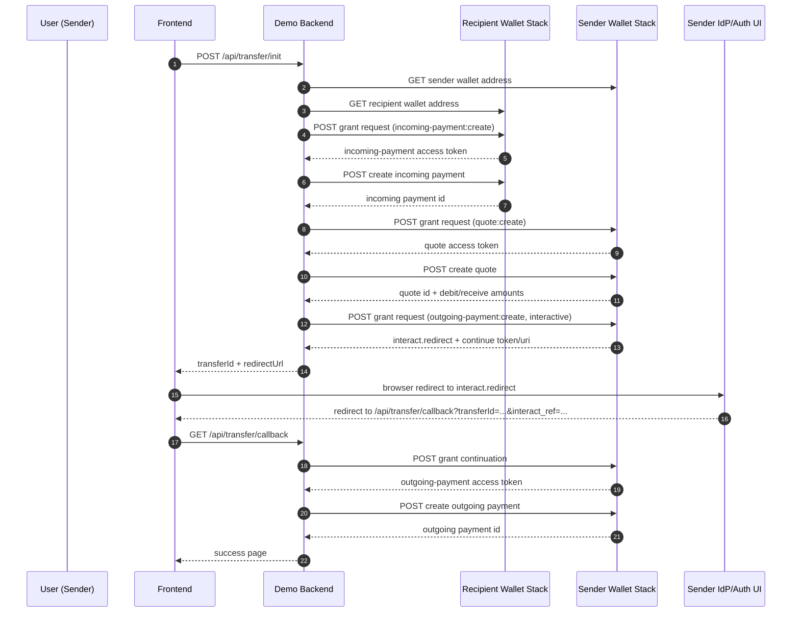

# Open Payments Community Portal: Comprehensive Guide

This document explains exactly how the localhost Open Payments community portal works end-to-end.

Portal pages:

1. `donations.html` - donors send funds to the configured recipient account.
2. `admin.html` - admins review and manage requests.
3. `request.html` - anyone can submit a funding request.

## 1. Purpose

This demo is a minimal proof-of-concept for person-to-person transfers using Open Payments.

The app does the following:

1. Reads sender and recipient wallet addresses.
2. Creates an incoming payment on the recipient side.
3. Creates a quote on the sender side.
4. Requests an interactive outgoing-payment grant from the sender authorization server.
5. Redirects sender for consent.
6. Continues the grant on callback and creates the outgoing payment.

Important protocol note:

- Open Payments coordinates payment instructions and authorization.
- Actual settlement is performed by wallet/account providers (ASEs), outside this app.

## 2. High-Level Architecture

- Frontend: `public/index.html`
  - Single-page form.
  - Calls backend APIs.
  - Redirects sender to provider consent page.
- Backend: `server.js` (Express)
  - Owns private key handling and Open Payments SDK calls.
  - Stores transfer state in memory (`Map`).
- Open Payments SDK: `@interledger/open-payments`
  - Authenticated client for protected operations.
  - Unauthenticated client for public wallet metadata.

## 3. Sequence Diagram



## 4. Backend Flow Details

### 4.1 Initialization: `POST /api/transfer/init`

Input fields:

- `senderWalletAddress`
- `recipientWalletAddress`
- `amount` (minor units)
- `assetCode` (UI field; backend now uses sender wallet metadata when available)
- `assetScale` (UI field; backend now uses sender wallet metadata when available)
- `keyId` (optional if set in `.env`)
- `privateKeyPath` (optional if set in `.env`; may be path or raw key content)

Execution steps on backend:

1. Validate request fields.
2. Build authenticated SDK client.
3. Resolve sender wallet address data.
4. Validate `keyId` exists in sender wallet key registry.
5. Resolve recipient wallet address data.
6. Request recipient incoming-payment grant.
7. Create recipient incoming payment.
8. Request sender quote grant.
9. Create quote using sender wallet asset metadata.
10. Request interactive outgoing-payment grant.
11. Store transfer context in memory.
12. Return `redirectUrl` to frontend.

Response example:

```json
{
  "transferId": "...",
  "redirectUrl": "https://auth.sender.example/...",
  "quoteId": "https://sender.example/quotes/...",
  "quoteExpiresAt": "2026-03-07T...Z",
  "incomingPaymentId": "https://recipient.example/incoming-payments/..."
}
```

### 4.2 Callback Finalization: `GET /api/transfer/callback`

Expected query params:

- `transferId`
- `interact_ref`
- optional `hash`

Execution steps:

1. Fetch transfer context from memory.
2. Optionally verify callback hash.
3. Continue interactive grant using stored `continue` token/URI.
4. Create outgoing payment using stored quote id.
5. Mark transfer completed and show success page.

Hash behavior:

- Controlled by `.env` variable `ENFORCE_CALLBACK_HASH`.
- Default is `false` for demo reliability.
- When false, hash mismatch is logged but does not block transfer.
- When true, hash mismatch fails callback.

## 5. API Reference

### 5.1 `GET /api/health`

Returns liveness and config state.

Example:

```json
{
  "ok": true,
  "serverTime": "2026-03-07T15:22:26.694Z",
  "defaultsConfigured": true,
  "enforceCallbackHash": false
}
```

### 5.2 `GET /api/wallet-info?url={walletAddress}`

Uses unauthenticated Open Payments client to fetch public wallet metadata.

Response shape:

```json
{
  "id": "https://wallet.example/sender",
  "assetCode": "SGD",
  "assetScale": 2,
  "authServer": "https://auth.wallet.example/",
  "resourceServer": "https://wallet.example/op"
}
```

### 5.3 `POST /api/transfer/init`

Starts transfer orchestration and returns `redirectUrl`.

### 5.4 `GET /api/transfer/callback`

Completes interactive grant and creates outgoing payment.

### 5.5 `GET /api/transfers/:id`

Returns in-memory transfer state for inspection/debugging.

## 6. Frontend Behavior

File: `public/index.html`

Frontend responsibilities:

1. Collect user input.
2. Auto-detect sender `assetCode` and `assetScale` via `/api/wallet-info`.
3. Submit transfer init request.
4. Redirect browser to `redirectUrl` for sender consent.

Key UX notes:

- Sender asset auto-fill runs on sender wallet field blur and before submit.
- Form supports raw key text or file path input for quick testing.

## 7. Credentials and Key Handling

Key sources:

- `.env` defaults (`KEY_ID`, `PRIVATE_KEY_PATH`), or
- per-request form fields (`keyId`, `privateKeyPath`).

Supported private key inputs:

1. PEM file path.
2. Raw PEM text.
3. Raw base64 PKCS8 key.
4. `PRIV...` compact format.

How backend processes key input:

- If input is a file path, file is used directly.
- If input is raw key content, backend converts to PEM if needed and writes a temporary key file under system temp dir.
- Temporary key files are cleaned up after transfer completion/failure.

## 8. Environment Variables

From `.env.example`:

- `KEY_ID`: optional default sender key id.
- `PRIVATE_KEY_PATH`: optional default private key path.
- `PUBLIC_BASE_URL`: base callback URL for interactive finish redirect.
- `PORT`: Express port.
- `ENFORCE_CALLBACK_HASH`: `true` or `false`.

Recommended for local demo:

- `ENFORCE_CALLBACK_HASH=false`

Recommended for stricter environments:

- `ENFORCE_CALLBACK_HASH=true`

## 9. Error Handling and Diagnostics

The backend wraps each major Open Payments call in step labels. Errors include the failed step name and available metadata.

Typical examples:

- `Create authenticated client failed: ...`
- `Get sender wallet address failed: ...`
- `Request incoming-payment grant failed: ...`
- `Create outgoing payment failed: ...`

Useful logs:

- `[wallet-info] ...`
- `[transfer-init] ...`
- `[transfer-callback] ...`

## 10. Common Failures and Fixes

### 10.1 `keyId '...' was not found in sender wallet key registry`

Cause:

- key id does not match sender wallet `jwks` entries.

Fix:

- Use the key id generated/uploaded for that sender wallet address.

### 10.2 `privateKeyPath does not exist: ...`

Cause:

- Path is invalid and value is not recognizable as raw key content.

Fix:

- Provide valid path, PEM text, base64 key, or `PRIV...` string.

### 10.3 `Error making Open Payments GET/POST request`

Cause:

- Upstream provider rejected request or wallet URL is invalid.

Fix:

- Use real wallet addresses.
- Check key/wallet pairing.
- Check provider status and auth server availability.

### 10.4 `Callback hash verification failed`

Cause:

- Hash mismatch in interactive callback.

Fix:

- For demo reliability, keep `ENFORCE_CALLBACK_HASH=false`.
- For strict validation, set `ENFORCE_CALLBACK_HASH=true` and ensure callback values are exact.

## 11. Security Characteristics

Current demo security controls:

- Private key operations happen server-side.
- Callback hash verification logic is present.
- Constant-time string comparison is used for hash comparisons.
- Key registry validation checks sender `keyId` membership.

Current demo limitations:

- In-memory transfer storage only.
- No persistent secret manager.
- No auth layer for API endpoints.
- Callback hash is non-blocking by default.

## 12. Production Hardening Checklist

1. Add user authentication and per-user transfer ownership checks.
2. Store transfer state in a database with expiration.
3. Move keys into a secure secrets store (HSM/KMS/Vault).
4. Remove raw key form input in production.
5. Enforce strict callback hash verification.
6. Add idempotency keys for transfer initialization and callback processing.
7. Add structured logging and request correlation ids.
8. Add retries/backoff for transient upstream failures.
9. Add rate limiting and abuse controls.
10. Add tests for each API step and callback edge case.

## 13. How to Run Locally

1. Install dependencies in `op-transfer-demo`.
2. Create `.env` from `.env.example`.
3. Start server.
4. Open `http://localhost:3000`.
5. Fill sender/recipient wallet info and credentials.
6. Submit and complete sender consent redirect.

## 14. Source Files

- `server.js`
- `public/index.html`
- `.env.example`
- `README.md`

This guide describes behavior as implemented in the current codebase.
